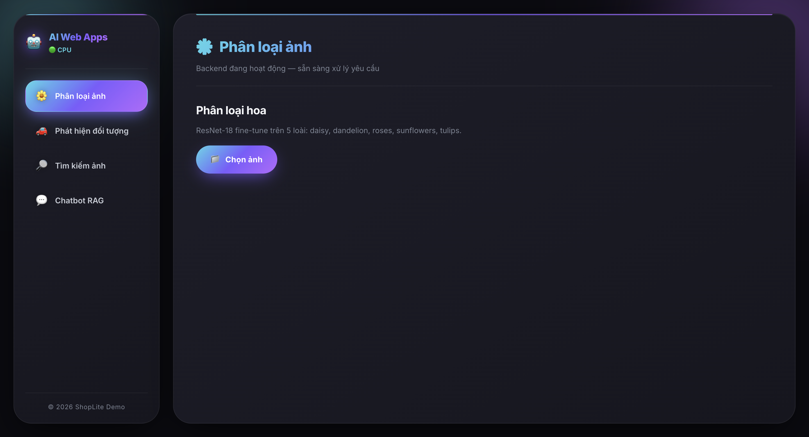
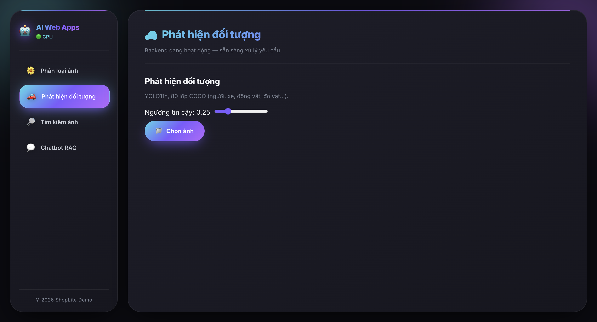
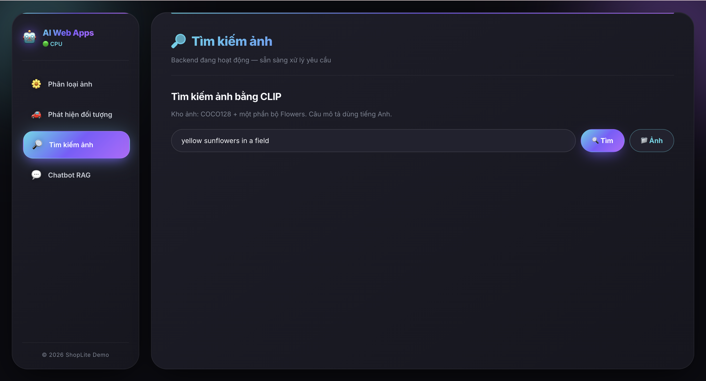
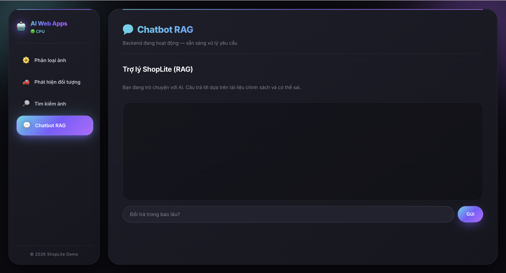
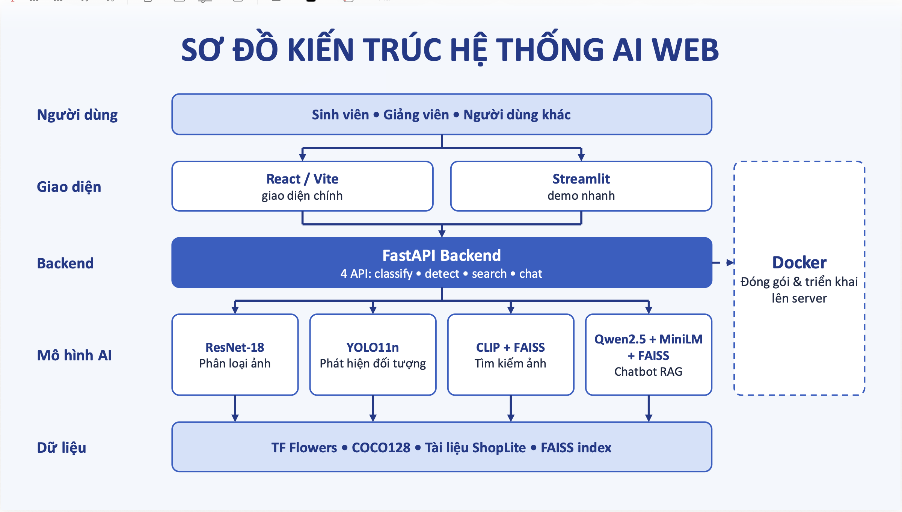
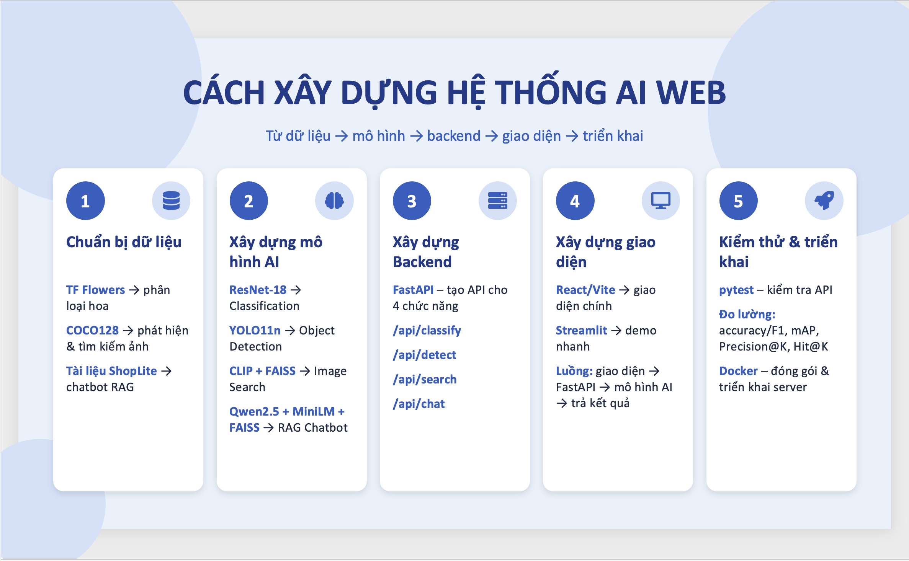

# 🤖 AI Web Apps

**Nền tảng web tích hợp 4 ứng dụng AI trong một giao diện duy nhất**

Phân loại ảnh · Phát hiện đối tượng · Tìm kiếm ảnh · Chatbot RAG

---

## 📖 Giới thiệu

**AI Web Apps** là một dự án full-stack minh họa cách đưa các mô hình học sâu từ notebook nghiên cứu lên sản phẩm web thực tế. Toàn bộ 4 ứng dụng AI được phục vụ sau **một backend FastAPI duy nhất**, với **một giao diện React hiện đại** dùng chung.

Dự án được xây dựng nhằm mục đích học tập — minh họa kiến trúc tách tầng giữa mô hình, API và giao diện, giúp sinh viên và lập trình viên có một điểm xuất phát hoàn chỉnh để phát triển sản phẩm AI của riêng mình.

### ✨ Điểm nổi bật

- 🎯 **4 ứng dụng AI trong 1** — phân loại ảnh, phát hiện đối tượng, tìm kiếm ảnh, chatbot RAG
- ⚡ **Một backend, hai giao diện** — FastAPI phục vụ cả API và bản build React
- 🧠 **Mô hình tải một lần** — tiết kiệm RAM/VRAM, sẵn sàng scale
- 🎨 **Giao diện Dark Mode** — thiết kế hiện đại với gradient cyan → tím
- 📡 **Streaming real-time** — chatbot dùng Server-Sent Events (SSE) cho phản hồi từng token
- 🔧 **Cấu hình qua biến môi trường** — không hard-code, dễ triển khai
- 🧪 **Test độc lập** — không cần GPU, không cần tải mô hình

---

## 🚀 Tính năng

### 1. 🌼 Phân loại ảnh hoa (Image Classification)

Nhận diện loài hoa từ ảnh người dùng tải lên.

| Thông số | Giá trị |
|---|---|
| **Mô hình** | ResNet-18 fine-tune (transfer learning từ ImageNet) |
| **Dữ liệu** | TF Flowers — 3.670 ảnh, 5 lớp |
| **Lớp** | daisy · dandelion · roses · sunflowers · tulips |
| **Đầu ra** | Top-3 dự đoán kèm độ tin cậy, cảnh báo nếu không chắc chắn |

**Demo:** Tải ảnh bông hoa bất kỳ → xem thanh tiến trình dự đoán cho từng lớp.

---

### 2. 🚗 Phát hiện đối tượng (Object Detection)

Khoanh vùng và nhận diện mọi đối tượng trong ảnh.

| Thông số | Giá trị |
|---|---|
| **Mô hình** | YOLO11n (pretrained COCO) |
| **Số lớp** | 80 lớp COCO (người, xe, động vật, đồ vật…) |
| **Đầu ra** | Danh sách hộp bao + nhãn + độ tin cậy, ảnh đã vẽ chú thích |

**Demo:** Tải ảnh có người/xe → xem các hộp màu bao quanh từng đối tượng. Có slider điều chỉnh ngưỡng tin cậy.

---

### 3. 🔎 Tìm kiếm ảnh (Image Retrieval)

Tìm ảnh bằng câu mô tả tiếng Anh hoặc bằng ảnh mẫu.

| Thông số | Giá trị |
|---|---|
| **Mô hình** | CLIP ViT-B/32 + FAISS |
| **Kho ảnh** | 128 ảnh COCO + 500 ảnh Flowers (~628 ảnh) |
| **Truy vấn** | Text → Ảnh, hoặc Ảnh → Ảnh |
| **Đầu ra** | Top-k ảnh giống nhất kèm điểm tương đồng |

**Demo:** Gõ `yellow sunflowers in a field` → xem lưới 5-12 ảnh phù hợp nhất.

---

### 4. 💬 Chatbot chăm sóc khách hàng (RAG)

Trợ lý ảo trả lời câu hỏi dựa trên tài liệu chính sách của cửa hàng giả lập **ShopLite**.

| Thông số | Giá trị |
|---|---|
| **Mô hình sinh** | Qwen2.5-1.5B-Instruct (GPU) / 0.5B (CPU) |
| **Mô hình embedding** | paraphrase-multilingual-MiniLM-L12-v2 |
| **Kho tri thức** | 6 tài liệu chính sách tiếng Việt (.md) |
| **Kỹ thuật** | RAG — Retrieval-Augmented Generation |
| **Giao tiếp** | Server-Sent Events (stream từng token) |

**Chủ đề hỗ trợ:**
- Chính sách bảo hành
- Chính sách đổi trả
- Chính sách giao hàng
- Khách hàng thân thiết
- Tài khoản & bảo mật
- Phương thức thanh toán

**Đặc điểm:**
- ✅ Trích nguồn tài liệu cho mỗi câu trả lời
- ✅ Từ chối lịch sự khi câu hỏi ngoài phạm vi
- ✅ Chống prompt injection

---

## 📸 Ảnh giao diện

### 🌼 Trang Phân loại ảnh

  

> Tải ảnh một bông hoa, mô hình ResNet-18 trả về top-3 loài kèm độ tin cậy. Cảnh báo hiển thị nếu mô hình không chắc chắn.

### 🚗 Trang Phát hiện đối tượng

  

> YOLO11n phát hiện và khoanh vùng các đối tượng trong ảnh. Slider điều chỉnh ngưỡng tin cậy (confidence threshold).

### 🔎 Trang Tìm kiếm ảnh

  

> Tìm kiếm ảnh bằng CLIP. Hỗ trợ cả truy vấn text (tiếng Anh) và truy vấn bằng ảnh mẫu.

### 💬 Trang Chatbot RAG

  

> Trợ lý ShopLite trả lời dựa trên tài liệu chính sách. Câu trả lời stream từng token, có expandable để xem nguồn.

---

## 🏗️ Kiến trúc

  

## 📑 Tiến trình xây dựng

  

